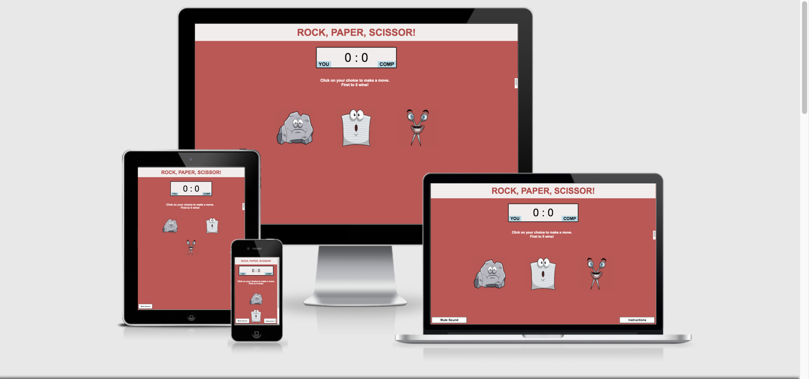

View the live project here: https://thomasjuth.github.io/Project-Number-2-Javascript/


<h1 align="center">Rock, Paper & Scissors</h1>


<h2 align="center"></h2>

## User Experience (UX)

-   ### User stories

    -   As a User

        1. I want to quickly understand the game.
        2. I want to be able to see my score as the game progresses.
        3. I want to be able to mute the sound. 
        4. I want to be able to play against the computer.
        5. I want to be entertained by the simplicity of the game and its quirky design.
        6. I want to be able to play the game on both mobile phone and computer.
        

    -   

-   ### Design
    -   #### Colour Scheme
        -   The two main colours are red and light blue. I was going for a childlike and very simple design, with soft pastel colors. The red and the light blue also suited the charcters well.
    -   #### Typography
        -   The Arial font is the main font used, as it suited the colors and the design really well. It is also clean and simple.
    -   #### Imagery
        -   Getting the right imagary was important and took a lot of searching. I wanted to create a funny and quirky game with funny looking chracters, rather than the usual approach. As soon as I found these, I knew they were perfect for the vibe I was going for. The aim is to put a smile on the face of the user.

         #### Sound
        -   I chose a sound that should remind the user of classic 8bit audio games. 

    -   Home Page Wireframe - [View](https://share.balsamiq.com/c/ueT19it3qmMogqy3b4FB6X.png)

    -   Mobile Wireframe - [View](https://share.balsamiq.com/c/aVdG5YbtuKonzxqaKr7e2u.png)

   

## Features

-   Responsive on all device sizes and built for mobile phone first.

-   Interactive elements

### Languages Used

-   [HTML5](https://en.wikipedia.org/wiki/HTML5)
-   [CSS3](https://en.wikipedia.org/wiki/Cascading_Style_Sheets)
-   [Javascript]
### Frameworks, Libraries & Programs Used


1. [GitHub:]

1. [Git](https://git-scm.com/)
    - Git was used for version control by utilizing the Gitpod terminal to commit to Git and Push to GitHub.
1. [GitHub:](https://github.com/)
    - GitHub is used to store the projects code after being pushed from Git.
1. 
## Testing

The W3C Markup Validator and W3C CSS Validator Services were used to validate every page of the project to ensure there were no syntax errors in the project.

-   [W3C Markup Validator](https://jigsaw.w3.org/css-validator/#validate_by_input) - [Results](https://thomasjuth.github.io/portfolio-project-1/)
-   [W3C CSS Validator](https://jigsaw.w3.org/css-validator/#validate_by_input) - [Results](https://jigsaw.w3.org/css-validator/validator?uri=https%3A%2F%2Fthomasjuth.github.i[…]&profile=css3svg&usermedium=all&warning=1&vextwarning=&lang=es)

### Testing User Stories from User Experience (UX) Section

-  
    


-   

### Further Testing

-   The Website was tested on Google Chrome, Internet Explorer, Microsoft Edge and Safari browsers.
-   The website was viewed on a variety of devices such as Desktop, Laptop, iPhone7, iPhone 8 & iPhoneX.
-   A large amount of testing was done to ensure that all pages were linking correctly.
-   Friends and family members were asked to review the site and documentation to point out any bugs and/or user experience issues.

### Known Bugs


### GitHub Pages

The project was deployed to GitHub Pages using the following steps...

1. Log in to GitHub and locate the [GitHub Repository](https://github.com/)
2. At the top of the Repository (not top of page), locate the "Settings" Button on the menu.
    - Alternatively Click [Here](https://raw.githubusercontent.com/) for a GIF demonstrating the process starting from Step 2.
3. Scroll down the Settings page until you locate the "GitHub Pages" Section.
4. Under "Source", click the dropdown called "None" and select "Master Branch".
5. The page will automatically refresh.
6. Scroll back down through the page to locate the now published site [link](https://github.com) in the "GitHub Pages" section.

### Forking the GitHub Repository

By forking the GitHub Repository we make a copy of the original repository on our GitHub account to view and/or make changes without affecting the original repository by using the following steps...

1. Log in to GitHub and locate the [GitHub Repository](https://github.com/)
2. At the top of the Repository (not top of page) just above the "Settings" Button on the menu, locate the "Fork" Button.
3. You should now have a copy of the original repository in your GitHub account.

### Making a Local Clone

1. Log in to GitHub and locate the [GitHub Repository](https://github.com/)
2. Under the repository name, click "Clone or download".
3. To clone the repository using HTTPS, under "Clone with HTTPS", copy the link.
4. Open Git Bash
5. Change the current working directory to the location where you want the cloned directory to be made.
6. Type `git clone`, and then paste the URL you copied in Step 3.

```
$ git clone https://github.com/YOUR-USERNAME/YOUR-REPOSITORY
```

7. Press Enter. Your local clone will be created.

```
$ git clone https://github.com/YOUR-USERNAME/YOUR-REPOSITORY
> Cloning into `CI-Clone`...
> remote: Counting objects: 10, done.
> remote: Compressing objects: 100% (8/8), done.
> remove: Total 10 (delta 1), reused 10 (delta 1)
> Unpacking objects: 100% (10/10), done.


Click [Here](https://help.github.com/en/github/creating-cloning-and-archiving-repositories/cloning-a-repository#cloning-a-repository-to-github-desktop) to retrieve pictures for some of the buttons and more detailed explanations of the above process.

### Credits

    1. The actual content in the menu was taken from an already existing Mexican Restaurant, Tom Tom's Burritos. This was to ensure that the food was authentic and as close as possbile to Mexican food.

### Content

-   All content was written by the developer.

-   Psychological properties of colours text in the README.md was found [here](http://www.colour-affects.co.uk/psychological-properties-of-colours)

### Media

-   All Images were created by the developer.

### Acknowledgements

-   My Mentor for continuous helpful feedback.

-   Tutor support at Code Institute for their support.